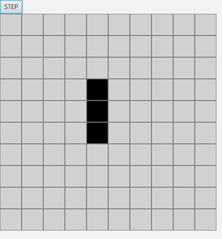

# Conway-Game-of-Life in JAVA

The Game of Life, also known simply as Life, is a cellular automaton. It is a zero-player game, meaning that its evolution is determined by its initial state, requiring no further input. One interacts with the Game of Life by creating an initial configuration and observing how it evolves. It is Turing complete and can simulate a universal constructor or any other Turing machine.

## Rules

1. Any live cell with fewer than two live neighbours dies, as if by underpopulation.
2. Any live cell with two or three live neighbours lives on to the next generation.
3. Any live cell with more than three live neighbours dies, as if by overpopulation.
4. Any dead cell with exactly three live neighbours becomes a live cell, as if by reproduction.

These rules, which compare the behavior of the automaton to real life, can be condensed into the following:

1. Any live cell with two or three live neighbours survives.
2. Any dead cell with three live neighbours becomes a live cell.
3. All other live cells die in the next generation. Similarly, all other dead cells stay dead.

## Examples

## Features
- User can any no of cells in the Box.
- STEP button will show the next iteration of cell.
- Press E in keyboard to erase the cell you want.
- Press D in keyboard to again add the cell wherever you want.

## Requirements
- JavaFx 5 +
- Java 11 +
- Maven 4+
- Git

## Installation
Written in Java using JavaFX

### 1.Download
 You can download the GameOfLife project directly from Github using the following command: git clone https://github.com/scortier/Conway-Game-of-Life.git

### 2. Build
First, go to the GameOfLife project base directory and run the following command: mvn package.

### 3. Launch
After building you can find the distribution file ..... file in the target directory. Type ..... to run the application.

## Purpose
This project was developed as part of Mini Bootcamp Day-1 organized by GoAcademy in GoSquad 4.0.
